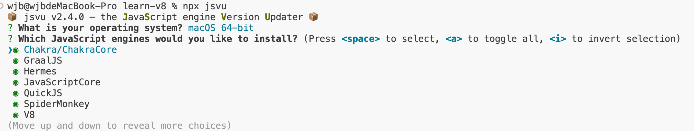

高级JS内核 - Chrome V8以及调试工具D8

# 一、编程语言发展史上的演变


## 1. 机器语言

机器语言是一种指令集体系，由计算机可以直接识别和执行的二进制代码组成。它是计算机硬件层面唯一能够直接理解和执行的语言，不需要任何解释或编译过程。机器语言中的每条指令都对应着计算机硬件的一个特定操作，例如数据的加载、存储、加法、减法等基本运算。

由于机器语言能够被计算机直接运行，因而天然具备灵活、执行速度快等优势。

```js
1000100111011000  机器指令
```
如下图，机器语言可以直接被CPU所执行。（CPU执行得细节这里不再阐述）


## 2. 汇编语言

前面我们提到了机器语言，机器语言由二进制代码构成。对于人类而言，极难阅读和理解。并且，用机器语言编写的程序只能在特定类型的计算机上运行。鉴于此，汇编语言慢慢诞生了。

汇编语言（Assembly Language）是一种低级编程语言，它提供了一种比机器语言更易于理解和编写的符号化表示方法。汇编语言与特定的计算机架构紧密相关，并且每一条汇编语言指令几乎都对应着一条特定的机器语言指令。

汇编语言堪称机器语言的进阶版本。它采用助记符来替代机器语言中的二进制数，从而更易于被人类理解和记忆。不过，汇编语言无法直接在浏览器中运行，而是需要借助汇编器将其转换为机器语言后，方可被执行。

```js
mov ax,bx         汇编指令
```

如下图所示：汇编语言需要借助汇编编译器来对其解析生成对应的机器语言，进而被CPU所执行。


它对机器语言做了一层抽象，减少了程序员理解机器语言的复杂度，但是汇编语言依然是复杂且繁琐的，即便你写一个非常简单的功能，也需要实现大量的汇编代码。

### 2.1 汇编语言的繁琐之处

#### 2.1.1 不同的CPU有不同的指令集

如果要使用机器语言或者汇编语言来实现一个功能，那么你需要为每种架构的 CPU 编写特定的汇编代码，这会带来巨大的、枯燥繁琐的操作。


如上图，需要为每种架构的CPU编写特定的汇编代码。

#### 2.1.2 不同的CPU有不同的指令集

在编写汇编代码时，我们还需要了解和处理器架构相关的硬件知识，比如你需要使用寄存器、内存、操作 CPU 等。
大部分程序员在编写应用的时候，只想专心处理业务逻辑，并不想要过多地理会这些处理器架构相关的细节。


## 3. 高级语言

前面我们提到了汇编语言，如果直接使用汇编语言，开发者需要考虑许多与业务无关的事情。因此我们需要一种屏蔽了计算机架构细节的语言，能适应多种不同 CPU 架构的语言，能专心处理业务逻辑的语言，诸如 C、C++、Java、C#、Python、JavaScript 等，这些“高级语言”就应运而生了。

高级编程语言是一种用于编写计算机软件的编程语言，它更接近人类自然语言，并且远离了计算机硬件的底层细节。高级语言的设计目的是为了提高编程效率和可读性，使得程序员能够更加专注于解决问题而不是底层技术细节。 

可是高级语言和汇编语言都存在同一个问题，就是无法被CPU直接执行。一般有2种方式来执行这些代码。

### 3.1 编译方式

#### 3.1.1 解析执行

需要先将输入的源代码通过解析器编译成中间代码，之后直接使用解释器解释执行中间代码，然后直接输出结果。 


#### 3.1.2 编译执行

采用这种方式时，也需要先将源代码转换为中间代码，然后我们的编译器再将中间代码编译成机器代码。通常编译成的机器代码是以二进制文件形式存储的，需要执行这段程序的时候直接执行二进制文件就可以了。还可以使用虚拟机将编译后的机器代码保存在内存中，然后直接执行内存中的二进制代码。


### 3.2 总结

以上就是计算机执行高级语言的两种基本的方式：解释执行和编译执行。但是针对不同的高级语言，这个实现方式还是有很大差异的，比如要执行 C 语言编写的代码，你需要将其编译为二进制代码的文件，然后再直接执行二进制代码。而对于像 Java 语言、JavaScript 语言等，则需要不同虚拟机，模拟计算机的这个编译执行流程。执行 Java 语言，需要经过 Java 虚拟机的转换，执行 JavaScript 需要经过 JavaScript 虚拟机的转换。

# 二、JS虚拟机强者-V8

众所周知，JS是一门高级语言。所以需要JS虚拟机对高级代码进行转换，转换成低级中间代码或者机器能够理解的机器代码。

即便是JS，也有好几种JS虚拟机，它们的实现方式也大不相同。其中最有名的也是使用最多的也就是Chrome V8虚拟机。

## 1. 认识浏览器的内核

不同的浏览器由不同的内核组成：

1. Gecko: 早期被 Netscape 和 Mozilla Firefox 浏览器所使用

# 如何查看当前电脑上谷歌浏览器v8版本

大多数基于 Chromium 的浏览器（如 Google Chrome 和 Microsoft Edge）都有一个内置的信息页面，您可以在其中查看 V8 引擎的版本号。以下是具体步骤：

1. 打开您的浏览器。
2. 在地址栏中输入 chrome://version/ 并按 Enter 键。
3. 查找 V8 版本号。
·
 

# 一、D8

D8 是一个非常有用的调试工具，你可以把它看成是 debug for V8 的缩写。我们可以使用 d8 来查看 V8 在执行 JavaScript 过程中的各种中间数据，比如作用域、AST、字节码、优化的二进制代码、垃圾回收的状态，还可以使用 d8 提供的私有 API 查看一些内部信息。

# 二、使用jsvu安装D8

jsvu是一个js引擎管理工具，如下图所示。


 
## 1. 本地安装jsvu

可以使用```npm install jsvu -g```进行全局安装，我们这里为了避免影响到其他内容，采取了本地安装的方法。

```js
npm install jsvu -D
```

## 2. 安装引擎

前面我们提到jsvu是一个js引擎管理工具，所以需要自己选择需要使用的引擎。直接执行```npx jsuv```命令。

### 1. 选择系统

第一步选择适合自己的系统即可。


### 2. 选择js引擎

第二步选择自己需要的js引擎，默认是全部都下载的，我们需要将除了v8 debug其余的js引擎使用空格键去掉，然后只选择一个v8 debug。



### 3. 回车安装

选择正确的引擎以后回车进行安装。


### 4. 配置环境变量

根据自己电脑的情况配置正确的环境变量

```js
export PATH=$PATH:/Users/wjb/.jsvu/bin
```

# 三、v8-debug 常用的命令

我们的index.js文件只有一行代码，为```let name = "hello";```

## 1. --print-bytecode 

打印生成的字节码

```js
[generated bytecode for function:  (0x200b00299afd <SharedFunctionInfo>)]
Bytecode length: 6
Parameter count 1
Register count 1
Frame size 8
         0x363200040044 @    0 : 13 00             LdaConstant [0]
         0x363200040046 @    2 : 27 03             StaCurrentScriptContextSlot [3]
         0x363200040048 @    4 : 0e                LdaUndefined
         0x363200040049 @    5 : af                Return
Constant pool (size = 1)
0x363200040011: [TrustedFixedArray]
 - map: 0x200b000005e5 <Map(TRUSTED_FIXED_ARRAY_TYPE)>
 - length: 1
           0: 0x200b00299add <String[5]: #hello>
Handler Table (size = 0)
Source Position Table (size = 0)
```

## 2. --print-ast 

查看编译生成的 AST


## 3. --print-code 

查看编译生成的代码